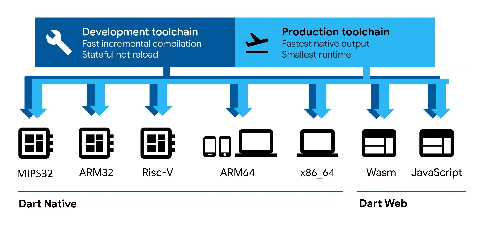

# Dart for MIPS32

This repository contains newly (re)added support for the MIPS32 architecture
(variants: Rev 1 and Rev 2).

The work was carried out by a small team during the 2025/2026 season (see the list below).
It reuses parts of the original MIPS32 port of Dart VM, which was originally developed
by Google engineers and later removed in 2017.

NOTE: User manual is at the end of this README, after the Roadmap section.

## An approachable, portable, and productive language for high-quality apps on any platform

Dart is:

  * **Approachable**:
  Develop with a strongly typed programming language that is consistent,
  concise, and offers modern language features like null safety and patterns.

  * **Portable**:
  Compile to ARM, x64, or RISC-V machine code for mobile, desktop, and backend.
  Compile to JavaScript or WebAssembly for the web.

  * **Productive**:
  Make changes iteratively: use hot reload to see the result instantly in your running app.
  Diagnose app issues using [DevTools](https://dart.dev/tools/dart-devtools).

Dart's flexible compiler technology lets you run Dart code in different ways,
depending on your target platform and goals:

  * **Dart Native**: For programs targeting devices (mobile, desktop, server, and more),
  Dart Native includes both a Dart VM with JIT (just-in-time) compilation and an
  AOT (ahead-of-time) compiler for producing machine code.

  * **Dart Web**: For programs targeting the web, Dart Web includes both a development time
  compiler (dartdevc) and a production time compiler (dart2js).



## License & patents

Dart is free and open source.

See [LICENSE][license] and [PATENT_GRANT][patent_grant].

## Using Dart

Visit [dart.dev][website] to learn more about the
[language][lang], [tools][tools], and to find
[codelabs][codelabs].

Browse [pub.dev][pubsite] for more packages and libraries contributed
by the community and the Dart team.

Our API reference documentation is published at [api.dart.dev](https://api.dart.dev),
based on the stable release. (We also publish docs from our
[beta](https://api.dart.dev/beta) and [dev](https://api.dart.dev/dev) channels,
as well as from the [primary development branch](https://api.dart.dev/be)).

## Building Dart

If you want to build Dart yourself, here is a guide to
[getting the source, preparing your machine to build the SDK, and building][building].

There are more documents in our repo at [docs](https://github.com/dart-lang/sdk/tree/main/docs).

## Contributing to Dart

The easiest way to contribute to Dart is to [file issues][issues].

You can also contribute patches, as described in [Contributing][contrib].

## Roadmap

Future plans for Dart are included in the combined Dart and Flutter
[roadmap][roadmap] on the Flutter wiki.

[building]: https://github.com/dart-lang/sdk/blob/main/docs/Building.md
[codelabs]: https://dart.dev/codelabs
[contrib]: https://github.com/dart-lang/sdk/blob/main/CONTRIBUTING.md
[issues]: https://github.com/dart-lang/sdk/issues
[lang]: https://dart.dev/guides/language/language-tour
[license]: https://github.com/dart-lang/sdk/blob/main/LICENSE
[patent_grant]: https://github.com/dart-lang/sdk/blob/main/PATENT_GRANT
[pubsite]: https://pub.dev
[repo]: https://github.com/dart-lang/sdk
[roadmap]: https://github.com/flutter/flutter/blob/master/docs/roadmap/Roadmap.md
[tools]: https://dart.dev/tools
[website]: https://dart.dev

## User manual

### 1. Install the necessary dependencies

```bash
$ sudo apt-get install git python3 curl xz-utils qemu-user
$ sudo apt-get install g++-i686-linux-gnu
```

---
### 2. Clone depot_tools repository and add it to the PATH

```bash
$ cd ~
$ git clone https://chromium.googlesource.com/chromium/tools/depot_tools.git
$ export PATH=~/depot_tools:$PATH
$ echo 'export PATH=~/depot_tools:$PATH' >> ~/.bashrc
```
---
### 3. Setting up the toolchain

#### 3.1. Download
```bash
$ wget https://toolchains.bootlin.com/downloads/releases/toolchains/mips32el/tarballs/mips32el--glibc--stable-2024.05-1.tar.xz
$ tar -xvf mips32el--glibc--stable-2024.05-1.tar.xz
```
#### 3.2. Copy the necessary files to the appropriate location

Within the downloaded toolchain, it is necessary to copy the files `crtbeginS.o` and `crtendS.o`.

The required files are located in the folder: `mips32el--glibc--stable-2024.05-1/lib/gcc/mipsel-buildroot-linux-gnu/13.3.0` and should be copied to the folder: `mips32el--glibc--stable-2024.05-1/mipsel-buildroot-linux-gnu/sysroot/usr/lib`

```bash
$ cd ~/mips32el--glibc--stable-2024.05-1
$ cp ./lib/gcc/mipsel-buildroot-linux-gnu/13.3.0/crtbeginS.o mipsel-buildroot-linux-gnu/sysroot/usr/lib
$ cp ./lib/gcc/mipsel-buildroot-linux-gnu/13.3.0/crtendS.o mipsel-buildroot-linux-gnu/sysroot/usr/lib
$ cd ~
```

Set `QEMU_LD_PREFIX` so that QEMU can locate the MIPS shared libraries at runtime:

```bash
$ export QEMU_LD_PREFIX=~/mips32el--glibc--stable-2024.05-1/mipsel-buildroot-linux-gnu
$ echo 'export QEMU_LD_PREFIX=~/mips32el--glibc--stable-2024.05-1/mipsel-buildroot-linux-gnu' >> ~/.bashrc
```

---
### 4. Clone the repository

```bash
$ mkdir dart && cd dart
$ git clone git@github.com:syrmia/dart-sdk.git sdk
```
---
### 5. Sync the dependencies that are necessary for build

Create the .gclient file in the parent directory of the cloned dart-sdk directory.
```bash
$ gclient config git@github.com:syrmia/dart-sdk.git
```

Inside the created .gclient file, set the name to sdk, like this:
```bash
"name": "sdk"
```

Then, run the following command to sync the dependencies:
```bash
$ DEPOT_TOOLS_UPDATE=0 gclient sync -D
```
---
### 6. Build Dart SDK

To build the project, navigate to the sdk directory:
```bash
$ cd ~/dart/sdk
```

And run the following command:
```bash
$ ./tools/build.py --arch mips --mode release --toolchain-prefix mips=~/mips32el--glibc--stable-2024.05-1/bin/mipsel-linux- --target-sysroot mips=~/mips32el--glibc--stable-2024.05-1/mipsel-buildroot-linux-gnu/sysroot --no-clang create_sdk -j8
```

After this step, verify that the Dart SDK compiled correctly by running:

```bash
$ cd ./out/ReleaseXMIPS/
$ ./dart --help
```

Expected output:

```prompt
Usage: dart <command|dart-file> [arguments]

Global options:
-v, --verbose               Show additional command output.
    --version               Print the Dart SDK version.
    --enable-analytics      Enable analytics.
    --disable-analytics     Disable analytics.
    --suppress-analytics    Disallow analytics for this `dart *` run without changing the analytics
                            configuration.
-h, --help                  Print this usage information.

Available commands:

Global
  install     Install or upgrade a Dart CLI tool for global use.
  installed   List globally installed Dart CLI tools.
  uninstall   Remove a globally installed Dart CLI tool.

Project
  build       Build a Dart application including code assets.
  compile     Compile Dart to various formats.
  create      Create a new Dart project.
  pub         Work with packages.
  run         Run a Dart program from a file or a local or remote package.
  test        Run tests for a project.

Source code
  analyze     Analyze Dart code in a directory.
  doc         Generate API documentation for Dart projects.
  fix         Apply automated fixes to Dart source code.
  format      Idiomatically format Dart source code.

Tools
  devtools    Open DevTools (optionally connecting to an existing application).
  info        Show diagnostic information about the installed tooling.

Run "dart help <command>" for more information about a command.
See https://dart.dev/tools/dart-tool for detailed documentation.
```

To run a Hello World Dart program, do the following:

```bash
$ nano hello_world.dart
```

Paste the following Dart code:

```dart
void main()
{
  print("Hello MIPS :)");
}
```

Then run it:
```bash
$ ./dart hello_world.dart
```

Expected output: `Hello MIPS :)`

---

### 7. Preparing for the test suite

Build the additional targets required for the Dart test suite:

```bash
$ cd ~/dart/sdk

$ ./tools/build.py --arch mips --mode release --toolchain-prefix mips=~/mips32el--glibc--stable-2024.05-1/bin/mipsel-linux- --target-sysroot mips=~/mips32el--glibc--stable-2024.05-1/mipsel-buildroot-linux-gnu/sysroot --no-clang run_vm_tests -j8

$ ./tools/build.py --arch mips --mode release --toolchain-prefix mips=~/mips32el--glibc--stable-2024.05-1/bin/mipsel-linux- --target-sysroot mips=~/mips32el--glibc--stable-2024.05-1/mipsel-buildroot-linux-gnu/sysroot --no-clang ffi_test_functions -j8

$ ./tools/build.py --arch mips --mode release --toolchain-prefix mips=~/mips32el--glibc--stable-2024.05-1/bin/mipsel-linux- --target-sysroot mips=~/mips32el--glibc--stable-2024.05-1/mipsel-buildroot-linux-gnu/sysroot --no-clang ffi_test_dynamic_library -j8
```

After this, the environment is ready for running tests.

---
### 8. Running the test suite

Run the following command from the root directory of the SDK:

```bash
$ cd ~/dart/sdk
$ ./tools/test.py --arch mips --mode release --timeout 1000
```

This can take a while. Release JIT testing takes about 7 to 8 hours, debug mode takes even longer.

---
### 9. Running Dart on a MIPS board

To run Dart natively on a MIPS board (e.g. MIPS Creator CI20):

**Requirements:**
- A MIPS board running mips32r1 or mips32r2 (matching the target the Dart SDK was compiled for)
- A Linux distribution on the board
- The full Dart SDK copied to the board (build on the host, building directly on the board is very slow)

**Steps:**
1. Copy the built SDK to the board.
2. Verify the basics work:
```bash
./dart --help
./dart hello_world.dart
```
3. Run the test suite:
```bash
cd /path/to/sdk
./tools/test.py --arch mips --mode release --timeout 1000
```

---
### 10. Running AOT tests

**1. Update toolchain paths in two files:**

In `pkg/test_runner/lib/src/compiler_configuration.dart`, find:
```dart
else if (_isSimMips || (_isMips && _configuration.useQemu)) {
  cc = 'mipsel-linux-gnu-gcc';
}
```
Replace with:
```dart
else if (_isSimMips || (_isMips && _configuration.useQemu)) {
  cc = '/path/to/mips32el--glibc--stable-2024.05-1/bin/mipsel-linux-gcc';
}
```

In `pkg/test_runner/lib/src/runtime_configuration.dart`, find:
```dart
mips._('qemu-mipsel', '/usr/mipsel-linux-gnu/');
```
Replace with:
```dart
mips._('qemu-mipsel', '/path/to/mips32el--glibc--stable-2024.05-1/mipsel-buildroot-linux-gnu/sysroot');
```

**2. Build `dartaotruntime`:**

```bash
./tools/build.py --arch mips --mode release \
  --toolchain-prefix mips=/path/to/mips32el--glibc--stable-2024.05-1/bin \
  --target-sysroot mips=/path/to/mips32el--glibc--stable-2024.05-1/mipsel-buildroot-linux-gnu/sysroot \
  dartaotruntime
```

**3. Run an AOT test:**

```bash
export QEMU_LD_PREFIX=/path/to/mips32el--glibc--stable-2024.05-1/mipsel-buildroot-linux-gnu/sysroot

tools/test.py -m release -a mips -c dartkp -r dart_precompiled --use-qemu \
  runtime/tests/vm/dart/spawn_uri_aot_test.dart
```

### Contributors

The MIPS32 port of Dart VM was contributed by the following engineers
(in alphabetical order):

- Aleksandar Djajic
- Andrea Milinkovic
- Djordje Todorovic
- Eldar Osmanovic
- Milica Matic
- Petar Jovanovic
- Slavisa Petrovic
